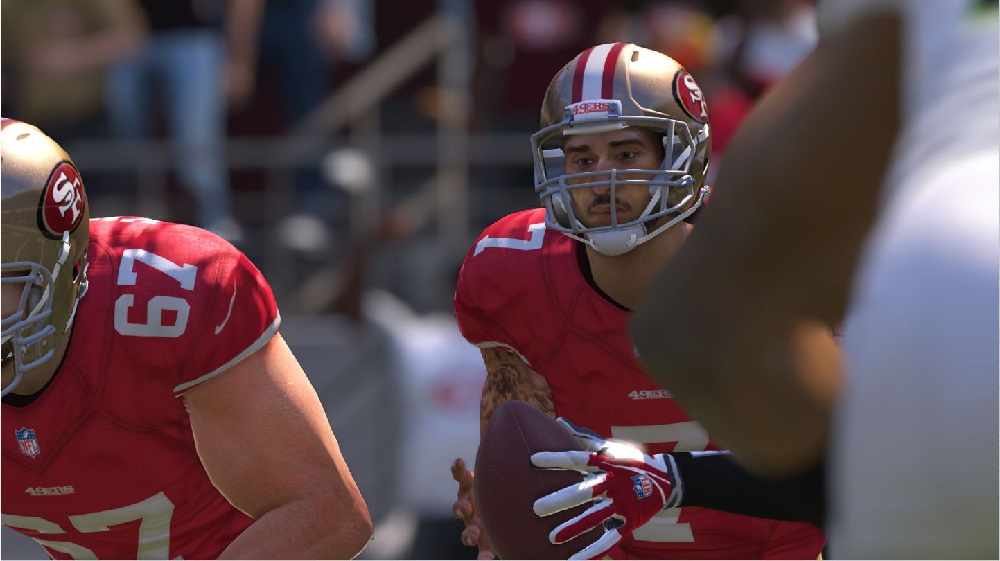
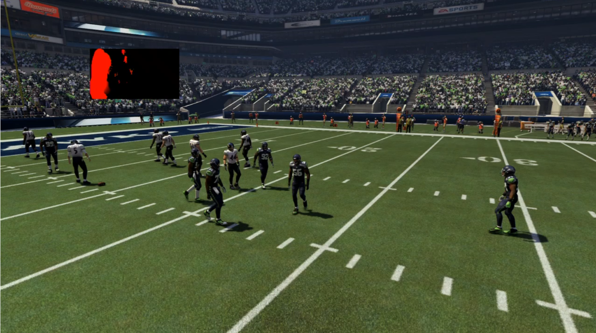

## Ishaan Singh, Electronic Arts

CIS 565 Guest Lecture

Monday, September 12

**Abstract**

Sports is often considered a less exciting video game to work on but what many people don’t realize is that having a reference for the virtual world in the real world makes photorealism the name of the game. A large variety of graphics algorithms are used to achieve depth of field like broad cast cameras, crisp shadows from complex stadium lights, and down to the blades of grass on a golf course. Another thing that is vital to a game company is that everything we do is performant and that’s a large part of the decision regarding whether a feature makes it to production.

**Bio**

[Ishaan Singh](https://www.linkedin.com/in/ishaan13) is a Rendering Engineer at EA Tiburon, which produces the Madden, NBA Live and PGA franchises. He’s worked previously on Madden 25, Madden 17 and PGA Tour. He's a Penn alum, received an MS from the Computer Graphics and Game Technology in 2012 and BS in Computer Science from IIIT Hyderabad in 2008. 
