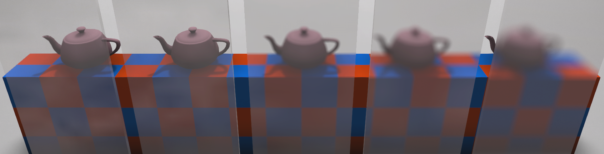
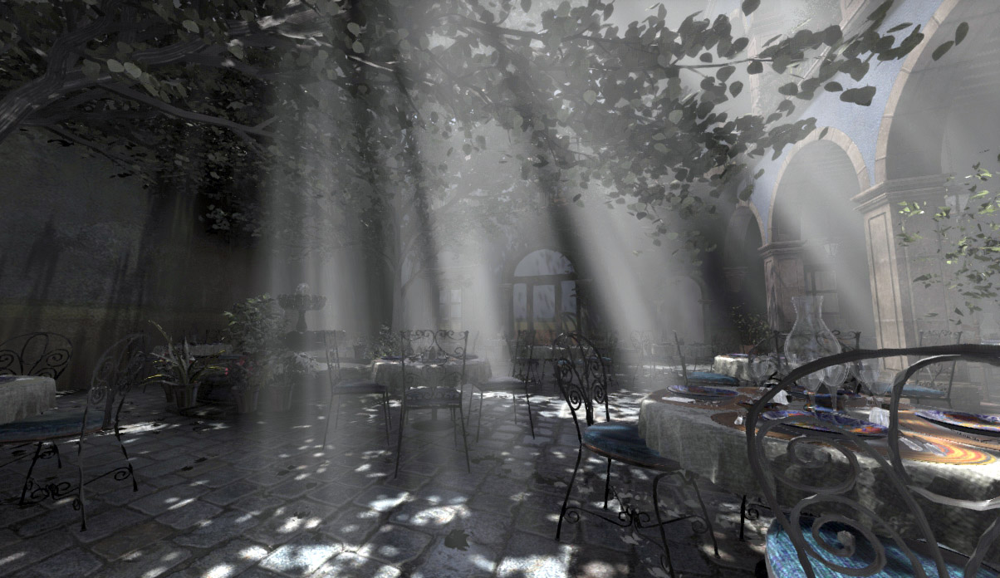
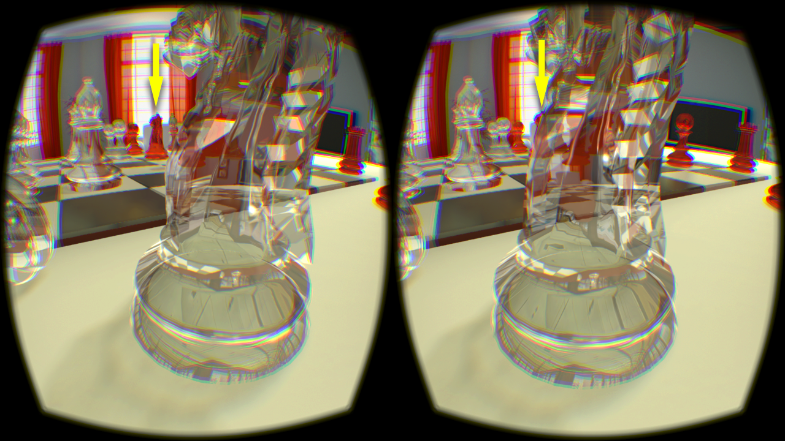

## Phenomenological Transparency

**Morgan McGuire**

CIS 565 Guest Lecture

Wednesday, November 30

### Abstract

This talk explains why transparency is one of the most significant challenges in computer rendering and presents a novel, practical solution for video games and other real-time applications. The new approach is the first to simultaneously and efficiently model all of the phenomena of transparency. These include refraction, partial coverage, colored shadows, caustics, volumetric light and shadows, and diffusion. The theme of the talk is a design methodology for real-time algorithms of driving approximations from constraints and perception instead of radiometric error.

### Bio

[Dr. Morgan McGuire](http://cs.williams.edu/~morgan/) is an Associate Professor of Computer Science at Williams College and researcher at NVIDIA. He's the coauthor of _Computer Graphics: Principles and Practice 3rd edition_, _The Graphics Codex_, and _Creating Games_, and contributed in industry to _Skylanders_, _Call of Duty_, _Guitar Hero_, _Marvel Ultimate Alliance_, the GeForce Pascal architecture, the Unity game engine, and the Amazon Kindle's eInk display.